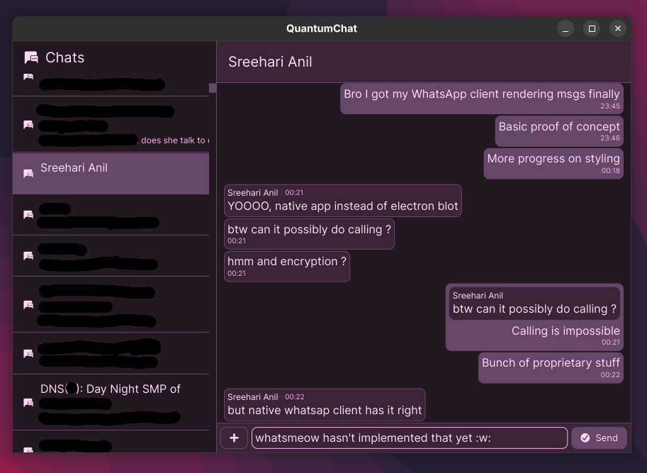

# quantumchat

A simple, powerful chat client for WhatsApp.

**WARNING: Highly incomplete and buggy. Continue at your own risk**

Technical details:

- Made in Rust and [Iced](https://iced.rs)
- Powered by [whatsmeow](https://github.com/tulir/whatsmeow)
- Also uses code from [nchat](https://github.com/d99kris/nchat)

This project is licensed under GNU General Public License v3.
See [LICENSE](./LICENSE) for more details.
